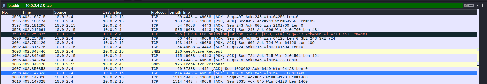

  
# Cyberdefenders - Lockdown Lab

 
## GUÍA COMPLETA EN ESPAÑOL 

  
  
  

  

# Indice  

## · PCAP Analysis  

## · Memory Dump Analysis  

## · Malware Sample Analysis

## PCAP Analysis  

### Question 1: After flooding the IIS host with rapid-fire probes, the attacker reveals their origin. Which IP address generated this reconnaissance traffic? / Después de inundar el host de IIS con sondeos rápidos y continuos, el atacante revela su origen. ¿Qué dirección IP generó este tráfico de reconocimiento?  

Vamos a introducirnos en statistics > conversations para que wireshark nos haga una vista de todas las comunicaciones en la captura:  

  

Resalta la comunicación entre las ips 10.0.2.4 y 10.0.2.15 por el gran número de paquetes en la comunicación, ahora vamos a realizar una búsqueda de la comunicación entre ambas ips:  

  

Hemos encontraod montones de paquetes TCP RST (reset) llegando a diferentes puertos de nuestro servidor IIS. Esto es un comportamiento típico de un escaneo de puertos, esto significa que el atacante estaba sondeando el servidor para identificar servicios abiertos y posibles puntos de entrada. Ya sabemos que la ip que estabamos buscando es la 10.0.2.24  

### Question 2: Zeroing in on a single open service to gain a foothold, the attacker carries out targeted enumeration. Which MITRE ATT&CK technique ID covers this activity? / Centrándose en un único servicio abierto para obtener un punto de apoyo, el atacante lleva a cabo una enumeración dirigida. ¿Qué ID de técnica de MITRE ATT&CK cubre esta actividad?  

Sabemos que el atacante lanzó un escaneo de puertos a nuestro servidor IIS, por lo que la técnica que usó el atacante según MITRE ATT&CK es "Network Service Discovery":  

  

### Question 3: While reviewing the SMB traffic, you observe two consecutive Tree Connect requests that expose the first shares the intruder probes on the IIS host. Which two full UNC paths are accessed? / Mientras revisas el tráfico SMB, observas dos solicitudes consecutivas de Tree Connect que revelan los primeros recursos compartidos (shares) que el intruso explora en el host IIS. ¿Cuáles son las dos rutas UNC completas a las que accede?  

Realizamos la búsqueda en wireshark "smb2.cmd == 3", esta búsqueda nos muestra las solicitudes (y respuestas) de tipo Tree Connect, es decir, las conexiones a recursos compartidos SMB. El número 3 indica el ID del tipo de operación, en este caso el número 3 representa TREE_CONNECT.  

  

### Question 4 : Inside the share, the attacker plants a web-accessible payload that will grant remote code execution. What is the filename of the malicious file they uploaded, and what byte length is specified in the corresponding SMB2 Write Request? / Dentro del recurso compartido, el atacante coloca una carga útil accesible desde la web que permitirá la ejecución remota de código. ¿Cuál es el nombre de archivo del fichero malicioso que subieron, y qué longitud en bytes se especifica en la correspondiente Solicitud SMB2 de escritura (SMB2 Write Request)?  

Nos vamos a file > export objects > smb y ahí encontramos el nombre de una shell:  

  

Ahora buscamos las transmisiones del protocolo smb2 y buscamos la siguiente captura:    

  

### Question 5: The newly planted shell calls back to the attacker over an uncommon but firewall-friendly port. Which listening port did the attacker use for the reverse shell? / La shell recién ejecutada se conecta de vuelta al atacante a través de un puerto poco común pero compatible con cortafuegos. ¿Qué puerto de escucha usó el atacante para la shell inversa (reverse shell)?  

Realizamos la siguiente búsqueda y encontramos el puerto usado para la reverse shell: ip.addr == 10.0.2.4 && tcp:  

  

## Memory Dump Anlysis  

### Question 6: Your memory snapshot captures the system’s kernel in situ, providing vital context for the breach. What is the kernel base address in the dump? / La instantánea de memoria captura el kernel del sistema in situ, proporcionando un contexto vital para la intrusión. ¿Cuál es la dirección base del kernel en el volcado?

Para ello vamos a analizar el archivo .mem con volatility3  usando el siguiente comando:  

  

**python3:** Ejecuta Python 3.  
**vol.py:** Script principal de Volatility 3.  
**-f /home/kali/Desktop/269-lockdown/memdump.mem:** Especifica el archivo de volcado de memoria (dump) a analizar.  
**windows.info:** Plugin que extrae información básica del sistema Windows. Este plugin proporciona información general del sistema capturado en el volcado de memoria:  

Versión de Windows (Windows 7, 10, 11, etc.)  
Arquitectura (32 o 64 bits)  
Número de procesadores.  
Información del kernel (versión, build)  
Dirección KDBG (Kernel Debugger Block)  
Fecha/hora del volcado.  

### Question 7: A trusted service launches an unfamiliar executable residing outside the usual IIS stack, signalling a persistence implant. What is the final full on-disk path of that executable, and which MITRE ATT&CK persistence technique ID corresponds to this behaviour? / Un servicio de confianza lanza un ejecutable desconocido ubicado fuera de la pila habitual de IIS, lo que indica un implante de persistencia. ¿Cuál es la ruta completa en disco de ese ejecutable, y qué ID de técnica de persistencia de MITRE ATT&CK corresponde a este comportamiento?  

Cmabiamos el plugin de volatility a pstree:  

  

**windows.pstree:** muestra los procesos en ejecución en forma de árbol jerárquico, revelando las relaciones padre-hijo entre procesos. Muestra la siguiente información:  

**PID (Process ID):** Identificador único del proceso.  
**PPID (Parent Process ID):** ID del proceso padre que lo creó.  
**Nombre del proceso.**  
**Número de threads.**
**Número de handles.**  
**Fecha/hora de inicio del proceso.**  
**Jerarquía visual con indentación que muestra qué proceso creó a cuál.**    

Ahora en MITRE ATT&CK buscaremos Startup y encontraremos lo siguiente:  

  

### Question 8: The reverse shell’s outbound traffic is handled by a built-in Windows process that also spawns the implanted executable. What is the name of this process, and what PID does it run under? / La salida (tráfico saliente) de la shell inversa es gestionada por un proceso integrado de Windows que además lanza el ejecutable implantado. ¿Cuál es el nombre de ese proceso y bajo qué PID se está ejecutando?  

Justo arriba en la búsqueda anterior con volatility3 tenemos las respuestas:  

  

## Malware Sample Analysis  

### Question 9: Static inspection reveals the binary has been packed to hinder analysis. Which packer was used to obfuscate it? / La inspección estática revela que el binario ha sido empaquetado para dificultar su análisis. ¿Qué empaquetador (packer) se usó para ofuscarlo?  

Subimos el archivo a virustotal y nos vamos a details:  

  

### Question 10: Threat-intel analysis shows the malware beaconing to its command-and-control host. Which fully qualified domain name (FQDN) does it contact? / El análisis de inteligencia de amenazas muestra que el malware está emitendo señales (beaconing) hacia su host de mando y control. ¿Qué nombre de dominio totalmente calificado (FQDN) contacta?  

Nos vamos a los comentarios de la comunidad y encontramos la respuesta:  

  

### Question 11: Open-source intel associates that hash with a well-known commodity RAT. To which malware family does the sample belong? / La inteligencia de fuentes abiertas asocia ese hash con un RAT de uso generalizado. ¿A qué familia de malware pertenece la muestra?  

En un comentario de abajo encontramos la respuesta:  

  

# DISCLAIMER

Este writeup es SOLO para propósitos educativos.  
Úsalo responsablemente en entornos autorizados como Cyberdefenders.  

**Autor:** pablocaraballofernandez  
**Plataforma:** Cyberdefenders

  
  
  
  
  .
  

